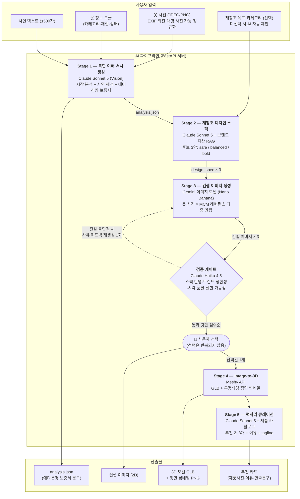
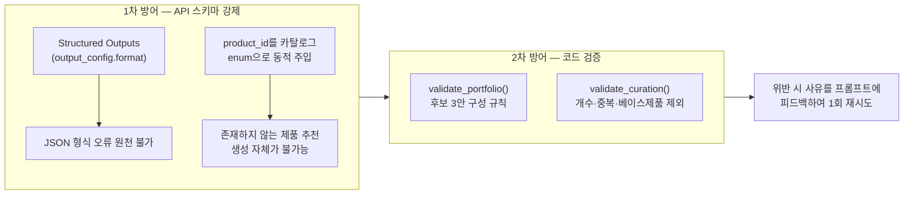
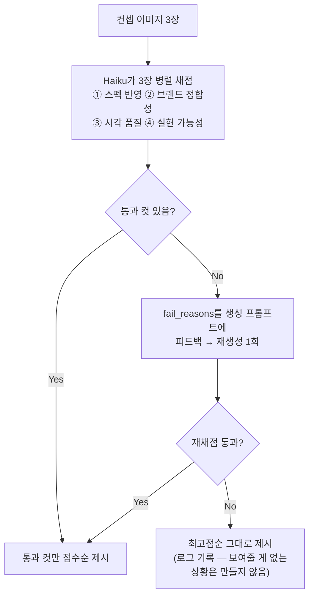
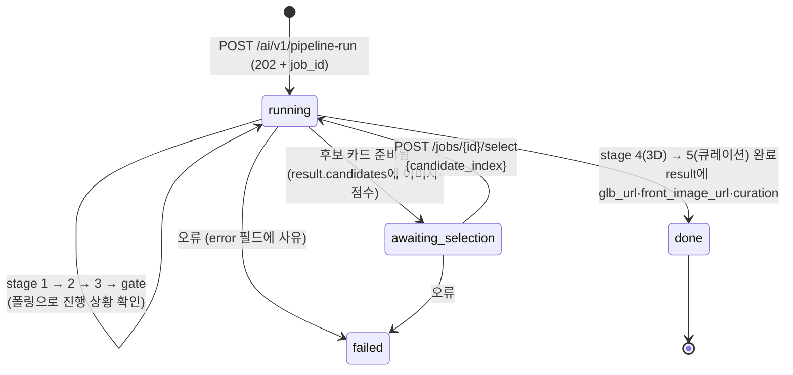
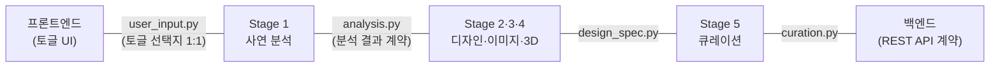

# 🦁 SKHU 멋쟁이사자처럼 14기 4팀 — AI 파이프라인

**MCM Upcycled Memory** — 추억이 담긴 옷 사진과 사연을 입력받아, MCM 헤리티지와 융합한
**3D 럭셔리 굿즈 · 디지털 보증서 · 제품 큐레이션**을 생성하는 AI 파이프라인입니다.

```
옷 사진 + 사연  ──▶  AI 분석  ──▶  재창조 디자인 3안  ──▶  컨셉 이미지 + 품질검증
                                                              │ 사용자 선택
                                        큐레이션  ◀──  3D 굿즈(GLB)  ◀──┘
```

---

## 1. 전체 아키텍처



### 모델 선정

| 역할 | 모델 | 선정 이유 |
|---|---|---|
| 분석·디자인·큐레이션 (Stage 1·2·5) | `claude-sonnet-5` | 이미지+텍스트 복합 추론, 감성적 글쓰기, **Structured Outputs**(스키마 강제) |
| 컨셉 이미지 (Stage 3) | Gemini 이미지 모델 (`gemini-3.1-flash-image`, 발표용 `gemini-3-pro-image`) | 다중 이미지 융합·자연어 편집 특화 |
| Image-to-3D (Stage 4) | Meshy | PBR 텍스처 품질 (비세토스 패턴·가죽 질감 재현) |
| 검증 게이트 | `claude-haiku-4-5` | 저비용·고속 — n장 전수 채점이 가능한 이유 |

---

## 2. 설계 원칙 — "모델은 제안하고, 하네스가 검증한다"

이 파이프라인의 핵심은 LLM 출력을 그대로 믿지 않는 **하네스(Harness) 계층**입니다.

### 2-1. 환각을 프롬프트가 아니라 구조로 차단



- **"지어내지 마세요"라고 부탁하지 않습니다** — 지어내는 것이 불가능한 구조를 만듭니다
- 스키마로 표현 못 하는 규칙(개수·중복·조합)은 결정론적 코드로 검증하고, 위반 사유를 다음 시도에 피드백합니다

### 2-2. 검증 게이트 — AI가 만든 것을 다른 AI가 검수

게이트는 **사용자 선택 앞**에 있습니다. 선택지의 품질을 보장하는 장치이지, 사용자의 선택을 번복하는 장치가 아닙니다.



- 재시도는 **정확히 1회**로 제한 — 무한 루프 불가, 데모 중 최대 지연 예측 가능
- "대담한 디자인 자체는 감점 아님" 명시 — bold 후보가 과감하다는 이유로 죽지 않게 (포트폴리오 보호)

### 2-3. 후보 3안 = 위험 포트폴리오

단일 호출로 **서로 다른 위험 수준의 후보 3개**를 강제 생성합니다 ("비슷한 것 3개" 문제의 구조적 차단):

| 프로파일 | 개입 강도 | 역할 |
|---|---|---|
| `safe` | Lv 1~2 (패턴 이식·패치) | 게이트 통과 확실 — 항상 보여줄 수 있는 보험 |
| `balanced` | Lv 2~3 (하이브리드) | 임팩트와 안정의 균형 |
| `bold` | Lv 4~5 (재구성·굿즈 전환) | 와우 포인트 담당 |

창의성의 코어는 방식이 아니라 **사연↔요소 매핑**입니다 — "해진 소매"를 결함이 아닌 디자인 요소(비저블 멘딩)로 살리고, 모든 적용 요소에 사연과 연결된 이유를 요구합니다.

### 2-4. 관찰가능성

모든 LLM/API 호출은 `trace_id` 단위로 JSONL 로그(`storage/logs/`)에 기록됩니다 — 모델·지연시간·**토큰 사용량(캐시 히트 포함)**·게이트 결과. 이상 결과의 단계별 역추적과 데모 후 비용 집계에 사용합니다.

---

## 3. API 서버 아키텍처

백엔드 팀이 호출하는 REST API로 전 구간이 노출됩니다. (실행: `uvicorn ai_pipeline.main:app --reload` → Swagger `http://localhost:8000/docs`)

### 동기 / 비동기 구분

| 방식 | 엔드포인트 | 기준 |
|---|---|---|
| **동기** (응답에 결과) | `POST /ai/v1/narrative` · `design-spec` · `concept-image` · `curation` | 수 초~수십 초 내 완료 |
| **동기** (조회) | `GET /ai/v1/recreation-categories` | 재창조 목표 카테고리 목록 — 프론트 토글용, Brand DB에서 자동 도출 |
| **비동기** (202 + job_id) | `POST /ai/v1/image-to-3d` · `pipeline-run` | 30초 이상 (3D 변환 등) |
| 폴링 | `GET /ai/v1/jobs/{job_id}` | `stage`·`detail`을 로딩 UI에 그대로 사용 |

- `pipeline-run`·`design-spec`의 `target_category`(선택)로 재창조 결과 카테고리를 지정할 수 있습니다.
  목록 밖 값은 job 생성 전에 422로 거절되며, 미지정 시 AI가 사연에 맞는 카테고리를 자동 제안합니다.
- 업로드 사진은 서버 입구에서 자동 정규화됩니다 — EXIF 회전 적용 + 4MB/2560px 초과 시 축소
  (폰 원본 사진이 Claude 이미지 상한을 넘겨 실패하는 문제를 실사진 E2E에서 발견·해결).

### E2E 파이프라인의 상태 머신 (`pipeline-run`)

사용자 선택이 파이프라인 중간에 있으므로, job이 **선택 대기 상태로 멈췄다가 재개**됩니다:



### 정적 파일 서빙 — 2D/3D 사용 위치

| 경로 | 내용 | 프론트 사용처 |
|---|---|---|
| `/ai/static/images/…` | 생성된 컨셉 이미지 (2D) | 후보 선택 카드 |
| `/ai/static/models/…glb` | 3D 모델 | 상세 화면 `<model-viewer>` (한 화면에 하나만) |
| `/ai/static/models/…_front.png` | **투명배경 정면 썸네일** (서버가 GLB를 렌더) | 컬렉션 그리드 — 3D 뷰어 여러 개는 무거우므로 ``로 |
| `/ai/assets/…` | MCM 제품 사진 | 큐레이션 추천 카드 |

---

## 4. 협업 구조 — 계약 우선(Contract-First) 개발

단계 간 입출력을 **Pydantic 스키마 파일로 먼저 확정**하고 각자 병렬 개발합니다.
스키마가 곧 계약서이므로, 계약 파일 수정은 상대 담당자와 협의 후에만 합니다.



- 각 스키마는 ① API 문서(Swagger 자동 생성) ② 런타임 검증(`model_validate`) ③ LLM 출력 강제(Structured Outputs)의 **단일 원천**
- 덕분에 Stage 1·5(팀원)와 Stage 2·3·4·서버(팀원)가 독립 개발 후 **수정 없이 병합**되었습니다

---

## 5. 디렉토리 구조

```
ai_pipeline/
├── main.py                  # FastAPI 엔트리포인트 (+ 정적 서빙 마운트)
├── config.py                # 모델 ID·경로·튜닝 노브의 단일 원천 (.env 로드)
├── api/
│   ├── router.py            # /ai/v1 라우터 모음
│   └── endpoints/           # stage1~5, full_pipeline(상태 머신), jobs(폴링)
├── schemas/                 # ★ 계약 파일들 (수정 시 협의)
│   ├── user_input.py        #   프론트 토글 ↔ Stage 1 (확정본)
│   ├── analysis.py          #   Stage 1 → Stage 2·5
│   ├── design_spec.py       #   Stage 2 → Stage 3·게이트 (+포트폴리오 검증)
│   ├── verification.py      #   게이트 채점 결과
│   ├── curation.py          #   Stage 5 출력 (+enum 동적 주입)
│   └── job.py               #   비동기 job 상태
├── services/
│   ├── llm_client.py        # Anthropic 래퍼 (Structured Outputs + 사용량 로깅)
│   ├── stage1_narrative.py  # 시각 분석 + 사연 다듬기/해석 분리
│   ├── stage2_design.py     # 브랜드 RAG + 후보 3안 단일 호출
│   ├── stage3_concept.py    # 다중 이미지 융합
│   ├── harness_gate.py      # 검증 게이트 (병렬 채점 + 재생성 오케스트레이션)
│   ├── stage4_meshy_3d.py   # 태스크 등록→폴링→GLB (+텍스처 튜닝 노브)
│   ├── glb_render.py        # GLB → 투명배경 정면 PNG (컬렉션 그리드용)
│   ├── stage5_curation.py   # 카탈로그 기반 큐레이션 (이중 가드레일)
│   ├── brand_assets.py      # 이미지 인덱스·디자인 코드 로더
│   └── job_store.py         # 인메모리 job 저장소 (⚠️ 워커 1개 전제)
├── data/
│   ├── mcm_brand_assets.json  # 브랜드 디자인 코드 (Stage 2·게이트의 근거)
│   └── mcm_catalog.json       # 제품 카탈로그 104종 — 전 카테고리 (Stage 5 enum의 원천)
scripts/                     # run_stage1~5, run_gate, run_e2e — 단계별·전체 실호출 확인용
tests/                       # 70+ 테스트 — API 키 없이도 로직 검증 가능하게 설계
data/                        # MCM 제품 이미지 113종 + _index.json (⚠️ 이미지는 git 미포함)
storage/                     # 생성 산출물 (images/ models/ logs/) — git 미포함
```

---

## 6. 실행 방법

```bash
pip install -r requirements.txt
# (선택) 3D 썸네일 렌더: pip install pyrender --no-deps  ← requirements.txt 주석 참고

cp .env.example .env          # Windows: copy .env.example .env
# .env에 API 키 입력 (ANTHROPIC_API_KEY, GOOGLE_API_KEY, MESHY_API_KEY)
# ⚠️ 값 뒤에 인라인 주석(#) 금지

uvicorn ai_pipeline.main:app --reload      # ⚠️ 워커 1개로만 (job 저장소가 인메모리)
# → http://localhost:8000/docs
```

테스트:

```bash
python -m pytest tests/                    # API 키 없이도 대부분 실행됨
python -m pytest tests/ -k "not smoke"     # 실호출(과금) 제외
```

단계별 확인 (실호출):

```bash
python scripts/run_stage1.py --image 옷사진.jpg
python scripts/run_stage2.py               # 최신 analysis로 후보 3안
python scripts/run_stage3.py --clothing 옷사진.jpg
python scripts/run_gate.py                 # 게이트 채점
python scripts/run_stage4.py               # 3D 변환 (크레딧 소모)
python scripts/run_stage5.py               # 큐레이션
```

---

## 7. 데이터 · 저작권

- MCM 제품 이미지는 **git에 포함하지 않습니다** (public 레포 — `.gitignore`로 차단).
  이미지 파일은 팀 드라이브로 공유하고 `data/<카테고리>/`에 배치하면 `data/_index.json`과 자동 일치합니다.
- 제품 이미지 서빙(`/ai/assets`)은 **로컬 시연 서버 전용**입니다.
- 사용자 업로드(사진·사연)는 로컬 `storage/`에만 보관하며 행사 종료 후 삭제합니다.
